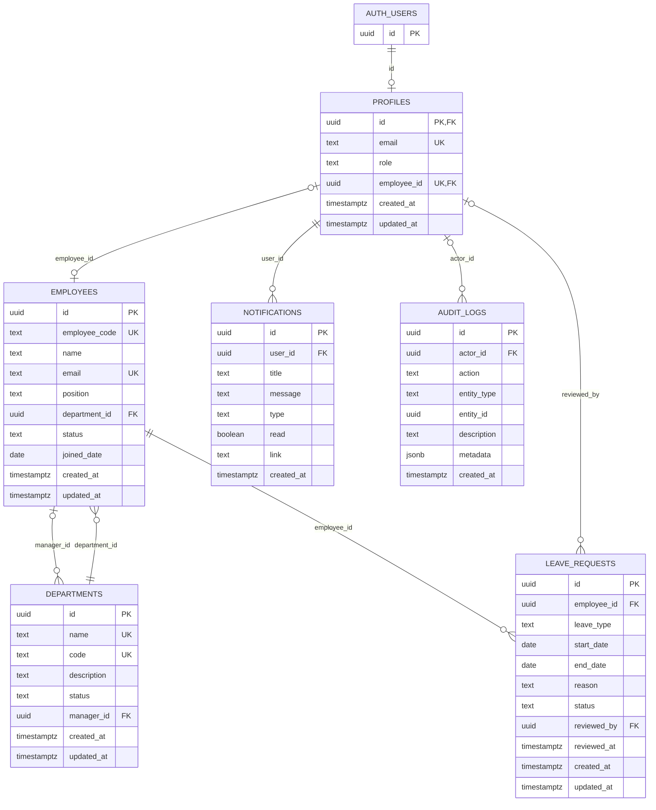

# Database and ERD

## Data ownership

Supabase provides the managed `auth.users` table. Application tables live in the `public` schema and use UUID primary keys. Frontend services map snake_case database rows to camelCase domain objects rather than leaking database naming through the UI.



## Entities and relationships

### `departments`

Stores name, unique code, description, status, optional manager, and timestamps. `manager_id` references `employees.id` and becomes null if that manager row is removed.

### `employees`

Stores the unique employee code and email, name, position, required department, employment status, joined date, and timestamps. Department deletion is restricted while employees reference it.

### `profiles`

Links application identity to `auth.users` through the same UUID. Role is limited to `admin` or `employee`. Employee profiles require an employee link; admin profiles do not have one. Each employee can be linked to at most one profile.

### `notifications`

Belongs to a profile through `user_id`. It stores title, message, one of the supported visual types, read state, optional link, and creation time. Deleting a profile cascades to its notifications.

### `audit_logs`

Records actor, action, entity type, optional entity ID, description, metadata, and time. If a profile is removed, historical audit entries remain and `actor_id` becomes null. Audit rows are append-only through normal client access; admins may delete them.

### `leave_requests`

Belongs to an employee and optionally references the reviewing profile. It stores leave type, date range, reason, status, review information, and timestamps. Employee and reviewer deletion is restricted while referenced.

Database checks allow leave types `Annual`, `Sick`, `Personal`, and `Unpaid`; statuses `Pending`, `Approved`, and `Rejected`; and require `end_date >= start_date`. Pending rows cannot contain reviewer details, while completed decisions require both `reviewed_by` and `reviewed_at`.

## RLS summary

| Table | Employee access | Admin access |
| --- | --- | --- |
| `profiles` | Select own profile | Select profiles |
| `employees` | Select linked row | Select and mutate all |
| `departments` | Select | Select and mutate |
| `notifications` | Select/insert/update/delete own rows | Same ownership rule |
| `audit_logs` | Insert as own actor | Insert, select, and delete |
| `leave_requests` | Select/insert own pending requests | Select and review all |

Table privileges and RLS work together. The trusted leave RPC intentionally crosses the ordinary notification ownership boundary only after verifying the caller and resolving the recipient internally.

## Leave transition and transaction

Supported transitions are:

```text
Pending → Approved
Pending → Rejected
```

The transition trigger prevents edits to request ownership/details and rejects a second or unsupported review. The `review_leave_request()` function adds row locking for concurrent reviews and atomically:

1. updates the leave request;
2. creates one notification for the employee profile;
3. creates one `STATUS_CHANGE` audit event.

An exception in any step aborts the database transaction.

## Migration history and existing-project warning

The populated portfolio Supabase project existed before migrations were formalized:

- `202609070001_initial_schema.sql` describes a fresh-project baseline.
- `202609070002_rls_policies.sql` describes the baseline RLS strategy.
- `202609070003_leave_management.sql` is the first new feature schema migration applied after baselining. It is standalone because the existing project had not executed 001/002.
- `202609080004_leave_review_rpc.sql` adds the trusted transactional review operation.

**Do not run 001 or 002 against the existing populated portfolio database.** They are reproducibility files for a fresh project and contain non-idempotent baseline table/policy creation.

For future changes:

```text
write migration → review SQL/security → apply to target project → verify → commit
```

New projects can follow the documented fresh-project setup in the repository README. Existing projects should apply only migrations that have not already been represented or deployed there.
